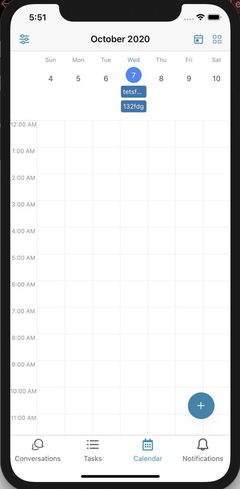
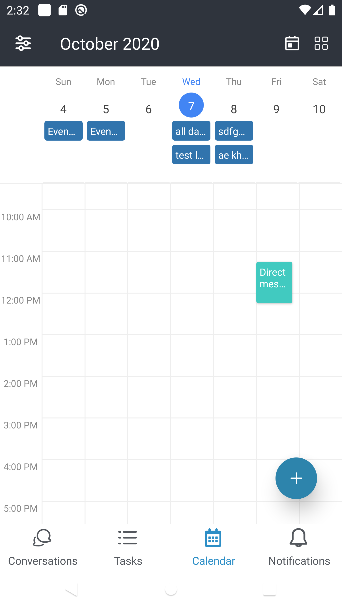

# Simple ScrollSpy

# react-native-event-week

Cross-platform gcal/outlook like calendar component for React Native.



# Features

- Cross Platform: Runs on the Web, iOS, Android with the power of React
- Type-safe: Fully written in TypeScript
- Customizable: Adjust styles of components
- Lightweight: ~15kb, only one dependency is `dayjs`

# Install

```
npm install --save react-native-event-week
```

Or if you use Yarn:

```
yarn add react-native-event-week
```

# Getting Started

```typescript
import { Calendar } from "react-native-event-week";

const events = [
  {
    title: "Important meeting",
    start: "2020-10-06 14:45",
    end: "2020-10-06 18:15",
    backgroundColor: "#41CAC0",
  },
  {
    title: "Coffee break",
    start: "2020-10-06 06:45",
    end: "2020-10-06 07:15",
    backgroundColor: "#41CAC0",
  },
];

function App() {
  return <Calendar events={events} height={600} />;
}
```

# API Documentation

**Summary**

```typescript
interface CalendarProps<T = {}> {
  events: Event<T>[];
  height: number;
  mode?: Mode;
  style?: ViewStyle;
  eventCellStyle?: EventCellStyle<T>;
  scrollOffsetMinutes?: number;
  date?: Date;
  swipeEnabled?: boolean;
  showTime?: boolean;
  refreshing: boolean;
  weekStartsOn?: WeekNum;
  locale?: string;
  onChangeDate?: DateRangeHandler;
  onPressEvent?: (event: Event<T>) => void;
  onPressDateHeader?: (date: Date) => void;
  onPressEventHeder?: (event: Event<T>) => void;
  onPressCell?: (date: Date) => void;
  onRefresh?: () => void;
}
```

`<Calendar />` Props are:

| name                  | required | type                                                                                | description                                                                                                                                                                                                          |
| --------------------- | -------- | ----------------------------------------------------------------------------------- | -------------------------------------------------------------------------------------------------------------------------------------------------------------------------------------------------------------------- |
| `events`              | yes      | `Array<{ title: string, start: Date, end: Date, children?: React.ReactNode }>`      | The events which will be rendered on the calendar, with optional children to display custom components on the event. Events that occur during the same time range will be layered, offset, and given a unique color. |
| `height`              | yes      | `number`                                                                            | Calendar height.                                                                                                                                                                                                     |
| `onPressEvent`        | no       | `(event: { title: string, start: Date, end: Date } => void)`                        | Event handler which will be fired when the user clicks an event.                                                                                                                                                     |
| `onChangeDate`        | no       | `([start, end]: [Date, Date]) => void`                                              | Event handler which will be fired when the current date range changed.                                                                                                                                               |
| `onPressCell`         | no       | `(date: Date) => void`                                                              | Event handler which will be fired when the current date cell is clicked. The minute set to 0.                                                                                                                        |
| `onPressDateHeader`   | no       | `(date: Date) => void`                                                              | Event handler which will be fired when the user clicks a date from the header.                                                                                                                                       |
| `mode`                | no       | `3days`, `week`, `day`                                                              |                                                                                                                                                                                                                      |
| `style`               | no       | `import('react-native').ViewStyle`                                                  |                                                                                                                                                                                                                      |
| `eventCellStyle`      | no       | `ViewStyle` or `((event: { title: string, start: Date, end: Date } ) => ViewStyle)` | The style of Event cell. Accepts either style object (static) or function (dynamic).                                                                                                                                 |
| `scrollOffsetMinutes` | no       | `number`                                                                            | Scroll to specific minutes in a day. e.g.) set `480` to scroll to 8am when the calendar rendered.                                                                                                                    |
| `date`                | no       | `Date`                                                                              | Initial date. Defualts to `Date`                                                                                                                                                                                     |
| `swipeEnabled`        | no       | `boolean`                                                                           |                                                                                                                                                                                                                      |
| `showTime`            | no       | `boolean`                                                                           |                                                                                                                                                                                                                      |
| `ampm`                | no       | `boolean`                                                                           | Use 12 hours time format instead of 24 hours.                                                                                                                                                                        |
| `weekStartsOn`        | no       | 0, 1, 2, 3, 4, 5, 6                                                                 | Which day the week starts on. Sunday is `0`.                                                                                                                                                                         |
| `locale`              | no       | `string`                                                                            | Custom locale. See I18n section                                                                                                                                                                                      |

# I18n

Please specity your locale via `locale` prop **and** import day.js locale file:

```typescript
import 'dayjs/locale/ja'

<Calendar
  locale="ja"
  {/* ... */}
/>
```

You can find your dayjs locale here:

https://github.com/iamkun/dayjs/tree/dev/src/locale

# Screenshots



<!--  -->

If you are using this library, please send a PR to add your organization!

# TODO

- [x] Add API Documentation
- [x] Add `onClickCell` feature
- [ ] Add `onDrugCell` feature
- [ ] Style customize
  - [ ] Blue active day
  - [ ] Blue active day text
  - [ ] Today indicator
- [ ] Support the month view layout
